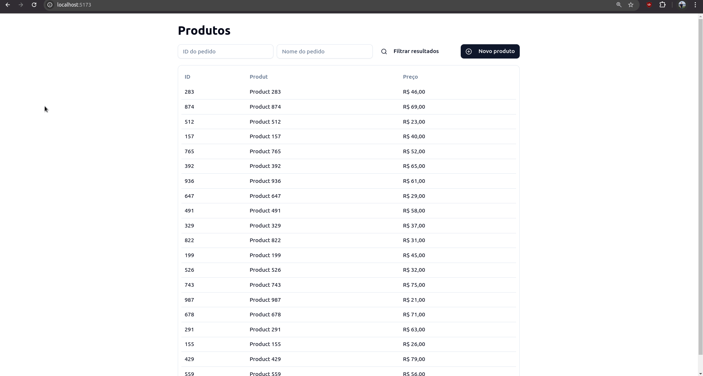

# URL & HTTP State

Este projeto é uma pequena aplicação React para estudo de tecnologias para gerenciar o estado e realizar requisições HTTP, além da biblioteca shadcn/ui. A aplicação permite a criação e listagem de produtos.

## Tecnologias Usadas

- React;
- TypeScript;
- Vite;
- React Hook Form;
- Zod;
- React Query;
- shadcn/ui;
- Tailwind CSS.

## Funcionalidades do Projeto

- **Listagem de Produtos**: exibe uma lista de produtos com ID, nome e preço.
- **Filtro de Produtos**: permite filtrar produtos por ID e nome.
- **Criação de Produtos**: Formulário para adicionar novos produtos à lista.
- **Persistência de Estado**: utiliza React Query para gerenciar e cachear o estado dos produtos.

## Gif do Projeto

